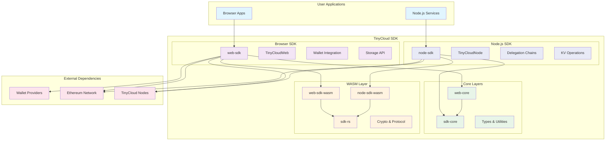
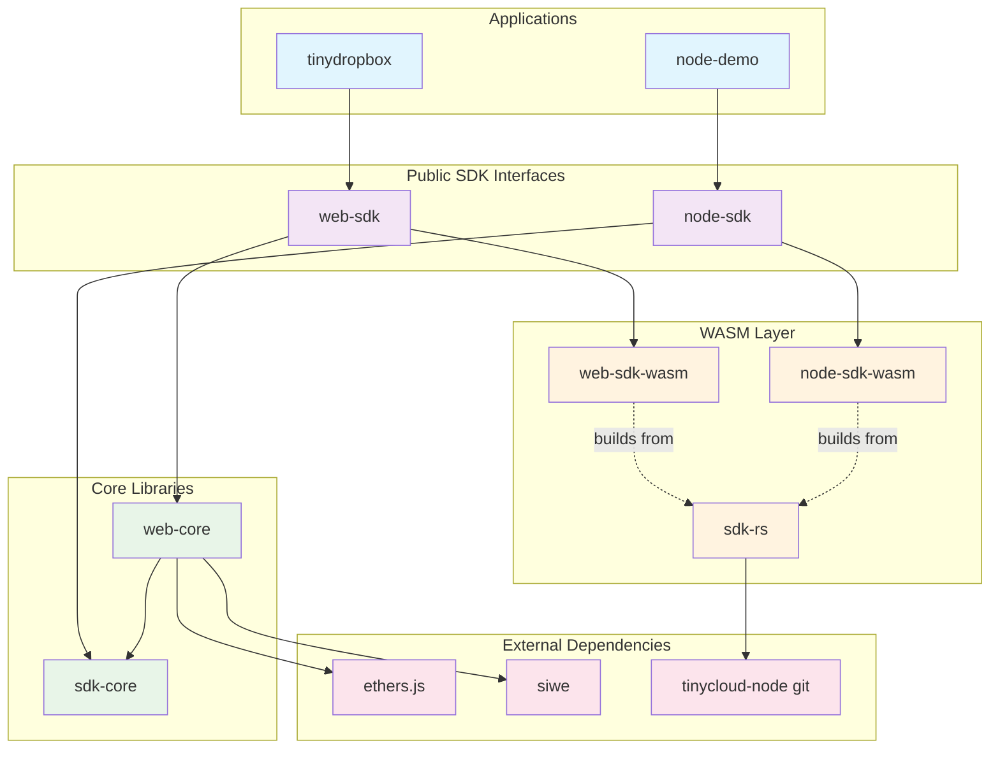
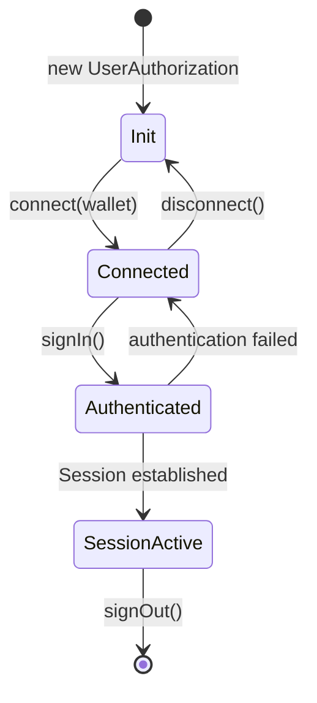
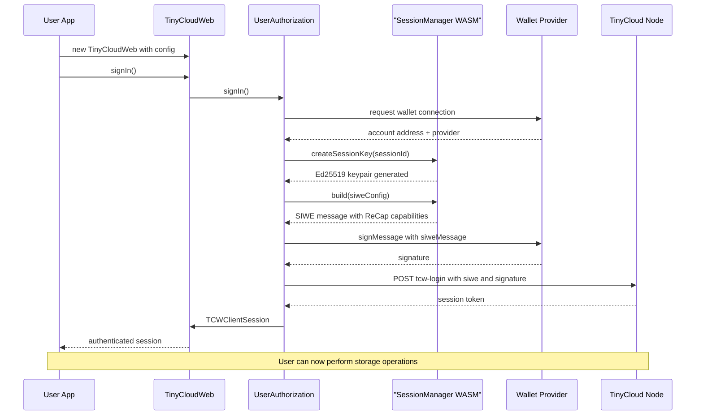
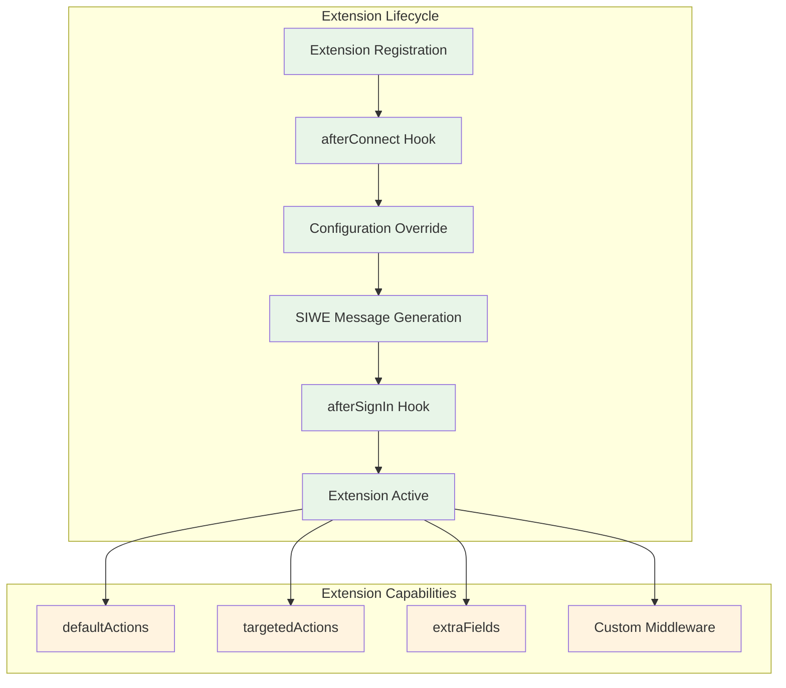
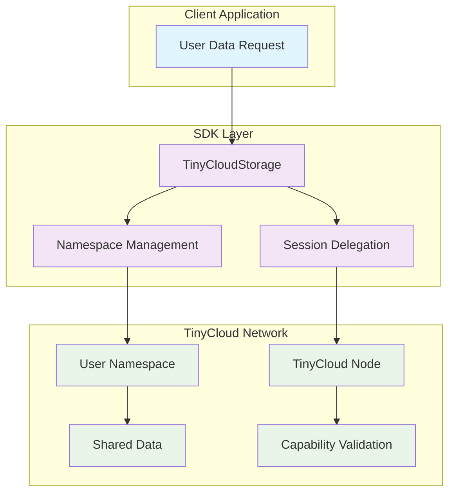
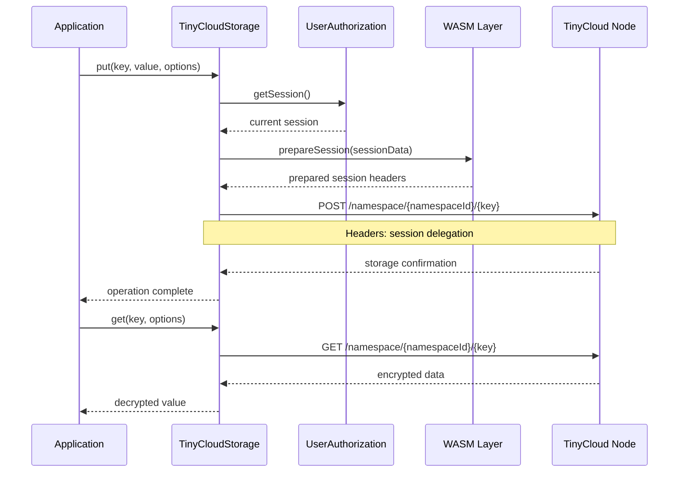
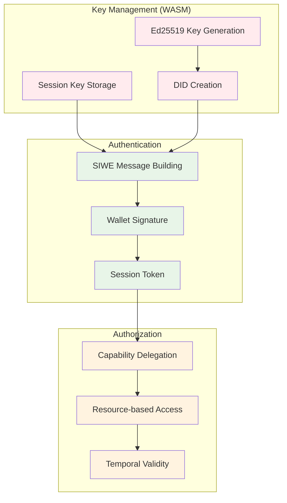
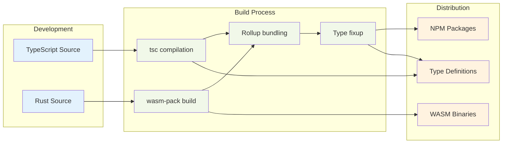

# TinyCloud SDK Architecture

## Executive Summary

The TinyCloud SDK is a sophisticated, multi-layered TypeScript/Rust toolkit that enables Web3 applications to integrate decentralized storage and user-controlled data management. The architecture provides two primary SDKs:

- **web-sdk**: Browser-focused SDK with wallet integration for client-side applications
- **node-sdk**: Server-focused SDK for delegation chains, automation, and backend services

The architecture follows a modular monorepo design with clear separation of concerns across seven packages, leveraging WebAssembly for security-critical operations and protocol implementation.

## System Overview

### High-Level Architecture



## Package Architecture

### Monorepo Structure

The project follows a Bun workspace configuration with the following packages:

```
web-sdk/
├── packages/
│   ├── sdk-rs/                    # Rust/WASM cryptographic layer
│   │   ├── web-sdk-wasm/          # WASM bindings for browser
│   │   └── node-sdk-wasm/         # WASM bindings for Node.js
│   ├── sdk-core/                  # Shared core utilities
│   ├── web-core/                  # Browser-specific core types
│   ├── web-sdk/                   # Browser SDK interface
│   └── node-sdk/                  # Node.js SDK interface
├── apps/
│   ├── node-demo/                 # Node.js delegation chain demo
│   └── tinydropbox/               # Browser example app
├── documentation/                 # Docusaurus documentation site
└── scripts/                       # Build and deployment scripts
```

### Dependency Graph



## Core Components Deep Dive

### 1. web-sdk: Browser SDK Layer

**Purpose**: Browser-focused SDK providing wallet integration, authentication, and decentralized storage for client-side applications.

**Key Classes**:

#### TinyCloudWeb (Main SDK Entry Point)
```typescript
interface TinyCloudWeb {
  // Authentication
  signIn(): Promise<TCWClientSession>
  signOut(): Promise<void>
  
  // Wallet Integration  
  address(): string
  chainId(): number
  getProvider(): providers.Web3Provider
  getSigner(): Signer
  
  // Core Services
  userAuthorization: IUserAuthorization
  storage: TinyCloudStorage
  
  // Utilities
  resolveEns(name: string): Promise<TCWEnsData>
  extend(extension: TCWExtension): void
}
```

#### UserAuthorization (Authentication Flow)


#### TinyCloudStorage (Data Management)
```typescript
interface TinyCloudStorage {
  // CRUD Operations
  get(key: string, options?: GetOptions): Promise<any>
  put(key: string, value: any, options?: PutOptions): Promise<void>
  list(options?: ListOptions): Promise<string[]>
  delete(key: string, options?: DeleteOptions): Promise<void>
  
  // Namespace Management
  namespaceId(): string
  createNamespace(name?: string): Promise<string>
  
  // Sharing & Delegation
  createSharingLink(key: string): Promise<string>
  createSessionDelegation(): Promise<SessionDelegation>
}
```

### 2. node-sdk: Server SDK Layer

**Purpose**: Node.js-focused SDK for server-side applications, enabling delegation management and automated workflows without browser wallet integration.

**Key Classes**:

#### TinyCloudNode (Main SDK Entry Point)
```typescript
interface TinyCloudNode {
  // Initialization with private key
  constructor(config: {
    privateKey: string,
    host: string,
    prefix?: string,
    autoCreateNamespace?: boolean,
  })

  // Authentication
  signIn(): Promise<void>
  signOut(): Promise<void>

  // Identity
  namespaceId: string
  pkhDid: string  // did:pkh:eip155:chainId:address
  sessionDid: string  // did:key:... (session key)

  // KV Storage
  kv: KVInterface

  // Delegation Management
  createDelegation(config: DelegationConfig): Promise<Delegation>
  createSubDelegation(parent: Delegation, config: DelegationConfig): Promise<Delegation>
  useDelegation(delegation: Delegation): Promise<DelegatedAccess>
}
```

#### DelegatedAccess (Namespace Access via Delegation)
```typescript
interface DelegatedAccess {
  // KV operations with inherited permissions
  kv: KVInterface

  // Delegation metadata
  delegationCid: string
  targetNamespaceId: string
  permissions: string[]
}
```

**Use Cases**:
- Server-side delegation chain management
- Automated data synchronization between namespaces
- Backend services that interact with user namespaces
- Testing and development workflows
- CI/CD integration for namespace operations

### 3. web-core: Foundation Layer

**Purpose**: Shared types, interfaces, and utilities for browser-based SDK, providing wallet integration and Web3 provider abstractions.

**Architecture Modules**:

#### Type System (`/types.ts`)
```typescript
// Provider abstraction for multiple RPC services
type TCWRPCProvider = 
  | TCWAlchemyProvider
  | TCWInfuraProvider  
  | TCWEtherscanProvider
  | TCWCustomProvider
  // ... other providers

// Flexible server integration
interface TCWServerRoutes {
  nonce?: TCWServerRouteEndpointType
  login?: TCWServerRouteEndpointType  
  logout?: TCWServerRouteEndpointType
}
```

#### Client Configuration (`/client/types.ts`)
```typescript
interface TCWClientConfig {
  providers?: TCWClientProviders
  siwe?: Partial<SiweConfig>
  server?: TCWServerRoutes
  extensions?: TCWExtension[]
}

interface TCWClientSession {
  address: string
  walletAddress: string
  chainId: number
  sessionKey: string
  siwe: string
  signature: string
  ens?: TCWEnsData
}
```

#### Provider Utilities (`/utils/utils.ts`)
```typescript
// Factory function for ethers.js providers
function getProvider(config: TCWRPCProvider): providers.BaseProvider

// ENS resolution with avatar support
function tcwResolveEns(provider: providers.BaseProvider, address: string): Promise<TCWEnsData>
```

### 4. sdk-core: Shared Utilities Layer

**Purpose**: Common utilities and types shared across both web-sdk and node-sdk, providing a consistent API surface.

**Key Modules**:
- Type definitions for KV operations
- Serialization utilities for delegations
- Common error types and handling
- Namespace ID formatting and validation

### 5. sdk-rs: Security & Performance Layer

**Purpose**: Rust implementation providing cryptographic primitives, WASM compilation for browser and Node.js, and integration with tinycloud-node protocol.

**Rust Module Architecture**:

#### Session Management (`/session/`)
```rust
// Core session manager with Ed25519 cryptography
pub struct SessionManager {
    keys: HashMap<String, JWK>,
    current_session: Option<String>,
}

impl SessionManager {
    pub fn create_session_key(&mut self, session_id: String) -> Result<(), Error>
    pub fn get_did(&self, session_id: &str) -> Result<String, Error>
    pub fn build(&self, config: SiweConfig) -> Result<String, Error>
}

// WASM bindings for JavaScript integration
#[wasm_bindgen]
pub struct TCWSessionManager {
    inner: SessionManager,
}
```

#### Integration with TinyCloud Protocol
```rust
// The sdk-rs package depends on tinycloud-node via git:
// [dependencies]
// tinycloud-sdk-rs = { git = "https://github.com/tinycloudlabs/tinycloud-node", rev = "..." }

// Key functions re-exported from tinycloud-sdk-rs:
// - makeNamespaceId: Create namespace identifier from address
// - prepareSession: Generate SIWE message with ReCap capabilities
// - completeSessionSetup: Finalize session with signature
// - invoke: Create invocation headers for API calls
// - createDelegation: Generate delegation with UCAN chain
// - useDelegation: Parse and validate delegation chain
```

#### WASM Compilation Targets

The sdk-rs package builds two separate WASM targets:

**web-sdk-wasm**: For browser environments
- Target: `wasm32-unknown-unknown`
- Uses `wasm-bindgen` for JavaScript interop
- Outputs ES modules compatible with bundlers

**node-sdk-wasm**: For Node.js environments
- Target: `wasm32-wasi` (or `wasm32-unknown-unknown` with Node.js shims)
- Includes Node.js-specific bindings
- Supports CommonJS and ESM module systems

## Authentication & Session Flow

### Complete Authentication Sequence



### Extension System Architecture



## Data Storage Architecture

### TinyCloud Storage Model



### Storage Operations Flow



## Security Model

### Cryptographic Architecture



### Security Boundaries

1. **WASM Isolation**: Cryptographic operations isolated in WebAssembly sandbox
2. **Session Management**: Temporary session keys with configurable expiration
3. **Capability-based Access**: Fine-grained permissions using SIWE ReCap
4. **Cross-origin Security**: Proper CORS handling and domain validation

## Performance Characteristics

### Build & Bundle Optimization



### Runtime Performance

- **WASM Execution**: Near-native speed for cryptographic operations
- **Async Initialization**: Non-blocking WASM module loading
- **Session Caching**: Persistent session state across page reloads
- **Lazy Loading**: Modules loaded on-demand based on configuration

## Development & Deployment

### Build Scripts & Automation

```bash
# Root level builds
bun run build         # Build all packages
./scripts/build.sh    # Alternative build script

# Package-specific
sdk-rs:      bun run build-dev | build-release
web-core:    bun run build
web-sdk:     bun run build

# Documentation
bun run docs:generate-api    # Generate API docs
bun run docs:dev            # Development server
```

### Release Management

- **Changesets**: Automated versioning and changelog generation
- **Multi-registry**: Support for both NPM and GitHub Package Registry
- **Workspace Dependencies**: Proper inter-package version management

## Integration Patterns

### Browser SDK Usage Pattern

```typescript
import { TinyCloudWeb } from '@tinycloudlabs/web-sdk';

// 1. SDK Initialization
const tcw = new TinyCloudWeb({
  providers: {
    web3: { /* wallet config */ },
    rpc: { service: 'alchemy', apiKey: 'key' }
  },
  modules: {
    storage: true
  }
});

// 2. Authentication Flow (with wallet)
await tcw.signIn();

// 3. Storage Operations
await tcw.storage.put('user-preferences', { theme: 'dark' });
const preferences = await tcw.storage.get('user-preferences');

// 4. Extension Integration
tcw.extend(customExtension);
```

### Node.js SDK Usage Pattern

```typescript
import { TinyCloudNode, serializeDelegation } from '@tinycloudlabs/node-sdk';

// 1. SDK Initialization (with private key)
const tc = new TinyCloudNode({
  privateKey: process.env.ETHEREUM_PRIVATE_KEY,
  host: 'https://tinycloud.example.com',
  autoCreateNamespace: true,
});

// 2. Authentication Flow (no wallet needed)
await tc.signIn();

// 3. Storage Operations
await tc.kv.put('user-preferences', { theme: 'dark' });
const preferences = await tc.kv.get('user-preferences');

// 4. Delegation Management
const delegation = await tc.createDelegation({
  path: 'shared/',
  actions: ['tinycloud.kv/get', 'tinycloud.kv/put'],
  delegateDID: 'did:pkh:eip155:1:0x...',
  allowSubDelegation: true,
});

// 5. Serialize and share delegation
const serialized = serializeDelegation(delegation);
// Send to delegate via secure channel
```

### Framework Integration

**Browser Frameworks**:
- **React**: Hooks for authentication state and storage operations
- **Vue**: Composables for reactive SDK integration
- **Vanilla JS**: Direct SDK usage with Promise-based API
- **TypeScript**: Comprehensive type definitions for all interfaces

**Node.js Frameworks**:
- **Express**: Middleware for delegation validation and namespace operations
- **NestJS**: Injectable services for TinyCloud integration
- **CLI Tools**: Command-line utilities for namespace management
- **Serverless**: Lambda/Edge functions with delegation-based access

## Future Architecture Considerations

### Scalability
- **Namespace Federation**: Multi-node data distribution
- **Caching Layers**: Client-side and CDN optimization
- **Load Balancing**: Intelligent node selection

### Protocol Evolution
- **Capability Expansion**: New ReCap capability types
- **Cross-chain Support**: Multi-blockchain session management
- **Identity Standards**: DID method standardization

---

This architecture enables developers to build user-controlled applications across both browser and server environments with confidence. The dual SDK approach (web-sdk for browsers, node-sdk for servers) provides the right abstractions for each platform while sharing core cryptographic and protocol implementations. Security, performance, and developer experience have been carefully balanced through a well-designed, layered architecture that scales from simple client applications to complex delegation chains.