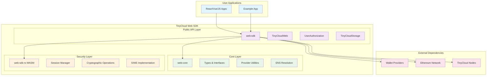
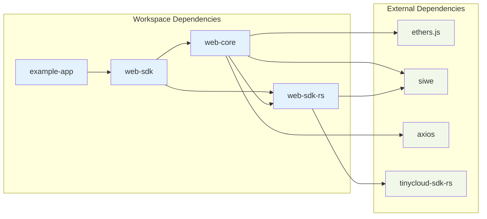
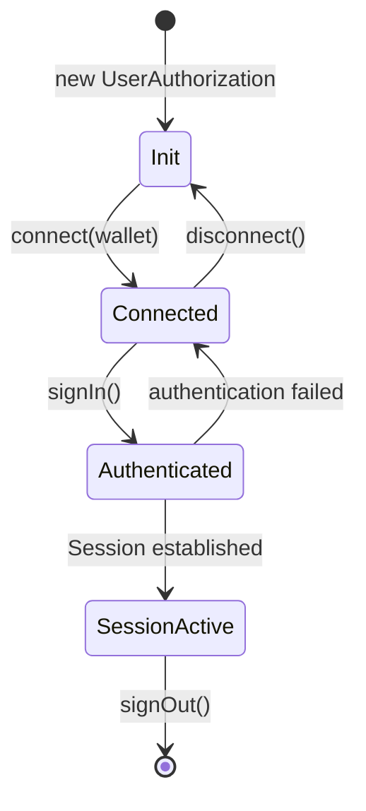
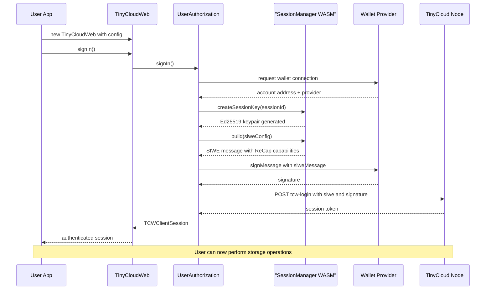
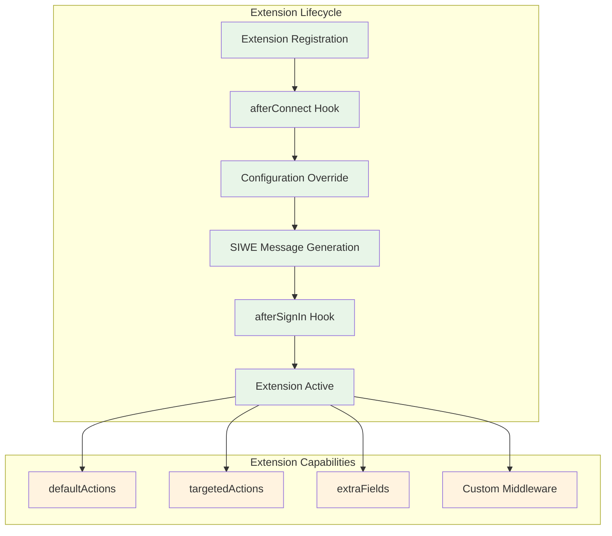
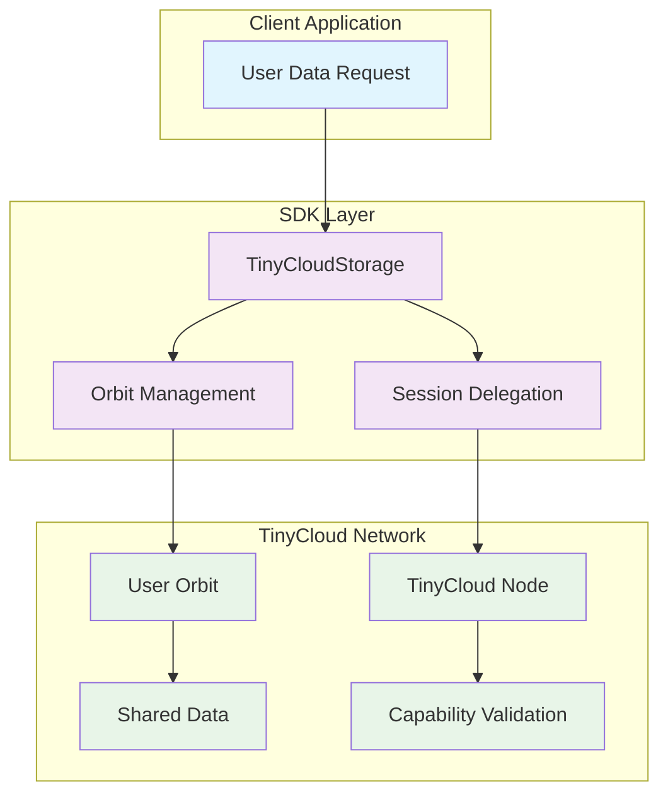
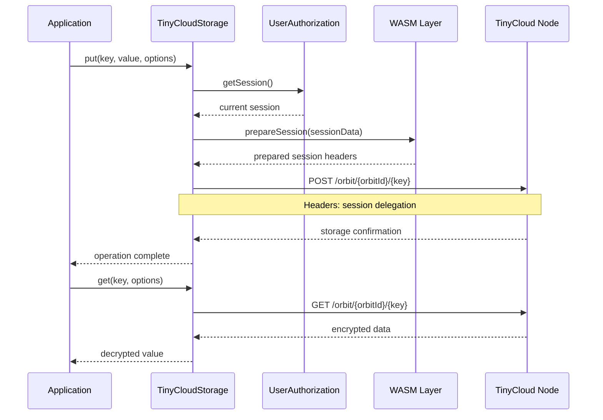
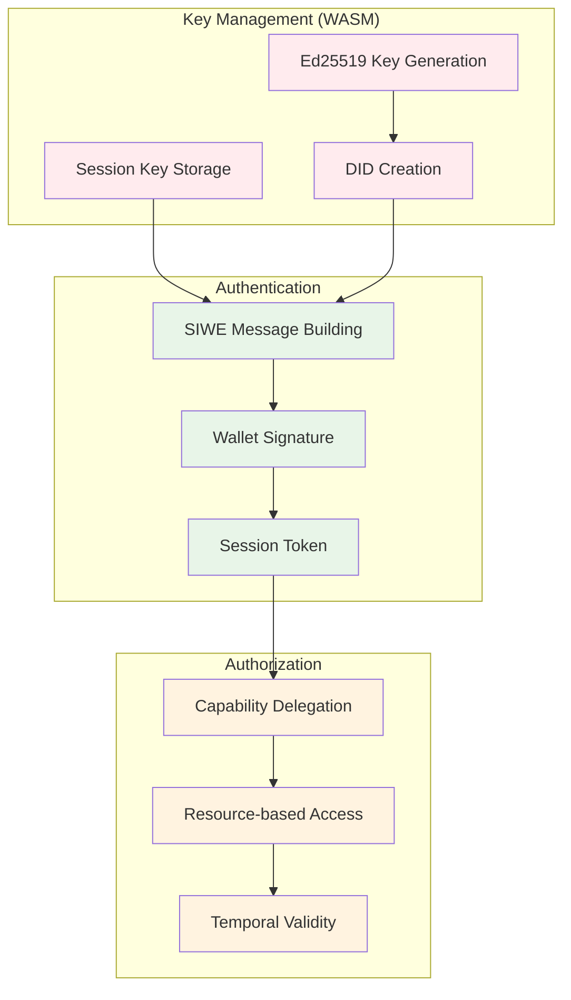
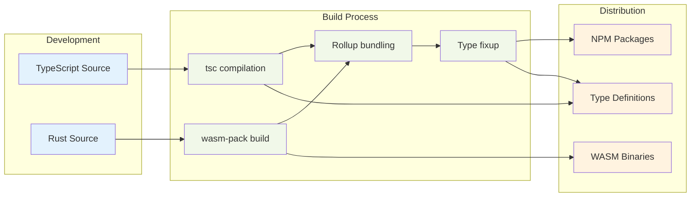

# TinyCloud Web SDK Architecture

## Executive Summary

The TinyCloud Web SDK is a sophisticated, multi-layered TypeScript/Rust SDK that enables Web3 applications to integrate decentralized storage and user-controlled data management. The architecture follows a modular monorepo design with clear separation of concerns across three core packages, leveraging WebAssembly for security-critical operations.

## System Overview

### High-Level Architecture



## Package Architecture

### Monorepo Structure

The project follows a Bun workspace configuration with the following packages:

```
tc-sdk/
├── packages/
│   ├── web-sdk-rs/         # Rust/WASM cryptographic layer
│   ├── web-core/           # TypeScript core types and utilities  
│   └── web-sdk/            # Main SDK interface
├── examples/
│   └── web-sdk-example/    # React demonstration app
├── documentation/          # Docusaurus documentation site
└── scripts/               # Build and deployment scripts
```

### Dependency Graph



## Core Components Deep Dive

### 1. web-sdk: Public API Layer

**Purpose**: Primary consumer interface providing high-level abstractions for Web3 authentication and decentralized storage.

**Key Classes**:

#### TinyCloudWeb (Main SDK Entry Point)
```typescript
interface TinyCloudWeb {
  // Authentication
  signIn(): Promise<TCWClientSession>
  signOut(): Promise<void>
  
  // Wallet Integration  
  address(): string
  chainId(): number
  getProvider(): providers.Web3Provider
  getSigner(): Signer
  
  // Core Services
  userAuthorization: IUserAuthorization
  storage: TinyCloudStorage
  
  // Utilities
  resolveEns(name: string): Promise<TCWEnsData>
  extend(extension: TCWExtension): void
}
```

#### UserAuthorization (Authentication Flow)


#### TinyCloudStorage (Data Management)
```typescript
interface TinyCloudStorage {
  // CRUD Operations
  get(key: string, options?: GetOptions): Promise<any>
  put(key: string, value: any, options?: PutOptions): Promise<void>
  list(options?: ListOptions): Promise<string[]>
  delete(key: string, options?: DeleteOptions): Promise<void>
  
  // Orbit Management
  orbitId(): string
  createOrbit(name?: string): Promise<string>
  
  // Sharing & Delegation
  createSharingLink(key: string): Promise<string>
  createSessionDelegation(): Promise<SessionDelegation>
}
```

### 2. web-core: Foundation Layer

**Purpose**: Shared types, interfaces, and utilities that define the SDK's contract and provide common functionality.

**Architecture Modules**:

#### Type System (`/types.ts`)
```typescript
// Provider abstraction for multiple RPC services
type TCWRPCProvider = 
  | TCWAlchemyProvider
  | TCWInfuraProvider  
  | TCWEtherscanProvider
  | TCWCustomProvider
  // ... other providers

// Flexible server integration
interface TCWServerRoutes {
  nonce?: TCWServerRouteEndpointType
  login?: TCWServerRouteEndpointType  
  logout?: TCWServerRouteEndpointType
}
```

#### Client Configuration (`/client/types.ts`)
```typescript
interface TCWClientConfig {
  providers?: TCWClientProviders
  siwe?: Partial<SiweConfig>
  server?: TCWServerRoutes
  extensions?: TCWExtension[]
}

interface TCWClientSession {
  address: string
  walletAddress: string
  chainId: number
  sessionKey: string
  siwe: string
  signature: string
  ens?: TCWEnsData
}
```

#### Provider Utilities (`/utils/utils.ts`)
```typescript
// Factory function for ethers.js providers
function getProvider(config: TCWRPCProvider): providers.BaseProvider

// ENS resolution with avatar support
function tcwResolveEns(provider: providers.BaseProvider, address: string): Promise<TCWEnsData>
```

### 3. web-sdk-rs: Security & Performance Layer

**Purpose**: WebAssembly module providing cryptographic primitives, secure session management, and performance-critical operations.

**Rust Module Architecture**:

#### Session Management (`/session/`)
```rust
// Core session manager with Ed25519 cryptography
pub struct SessionManager {
    keys: HashMap<String, JWK>,
    current_session: Option<String>,
}

impl SessionManager {
    pub fn create_session_key(&mut self, session_id: String) -> Result<(), Error>
    pub fn get_did(&self, session_id: &str) -> Result<String, Error>
    pub fn build(&self, config: SiweConfig) -> Result<String, Error>
}

// WASM bindings for JavaScript integration
#[wasm_bindgen]
pub struct TCWSessionManager {
    inner: SessionManager,
}
```

#### Integration with TinyCloud Protocol
```rust
use tinycloud_sdk_wasm::{
    makeOrbitId, prepareSession, completeSessionSetup,
    invoke, generateHostSIWEMessage, siweToDelegationHeaders
};
```

## Authentication & Session Flow

### Complete Authentication Sequence



### Extension System Architecture



## Data Storage Architecture

### TinyCloud Storage Model



### Storage Operations Flow



## Security Model

### Cryptographic Architecture



### Security Boundaries

1. **WASM Isolation**: Cryptographic operations isolated in WebAssembly sandbox
2. **Session Management**: Temporary session keys with configurable expiration
3. **Capability-based Access**: Fine-grained permissions using SIWE ReCap
4. **Cross-origin Security**: Proper CORS handling and domain validation

## Performance Characteristics

### Build & Bundle Optimization



### Runtime Performance

- **WASM Execution**: Near-native speed for cryptographic operations
- **Async Initialization**: Non-blocking WASM module loading
- **Session Caching**: Persistent session state across page reloads
- **Lazy Loading**: Modules loaded on-demand based on configuration

## Development & Deployment

### Build Scripts & Automation

```bash
# Root level builds
bun run build         # Build all packages
./scripts/build.sh    # Alternative build script

# Package-specific
web-sdk-rs:  bun run build-dev | build-release
web-core:    bun run build
web-sdk:     bun run build

# Documentation
bun run docs:generate-api    # Generate API docs
bun run docs:dev            # Development server
```

### Release Management

- **Changesets**: Automated versioning and changelog generation
- **Multi-registry**: Support for both NPM and GitHub Package Registry
- **Workspace Dependencies**: Proper inter-package version management

## Integration Patterns

### Recommended Usage Pattern

```typescript
// 1. SDK Initialization
const tcw = new TinyCloudWeb({
  providers: {
    web3: { /* wallet config */ },
    rpc: { service: 'alchemy', apiKey: 'key' }
  },
  modules: {
    storage: true
  }
});

// 2. Authentication Flow
await tcw.signIn();

// 3. Storage Operations
await tcw.storage.put('user-preferences', { theme: 'dark' });
const preferences = await tcw.storage.get('user-preferences');

// 4. Extension Integration
tcw.extend(customExtension);
```

### Framework Integration

- **React**: Hooks for authentication state and storage operations
- **Vue**: Composables for reactive SDK integration  
- **Vanilla JS**: Direct SDK usage with Promise-based API
- **TypeScript**: Comprehensive type definitions for all interfaces

## Future Architecture Considerations

### Scalability
- **Orbit Federation**: Multi-node data distribution
- **Caching Layers**: Client-side and CDN optimization
- **Load Balancing**: Intelligent node selection

### Protocol Evolution
- **Capability Expansion**: New ReCap capability types
- **Cross-chain Support**: Multi-blockchain session management
- **Identity Standards**: DID method standardization

---

This architecture enables developers to build user-controlled applications with confidence, knowing that security, performance, and developer experience have been carefully balanced through a well-designed, layered architecture.